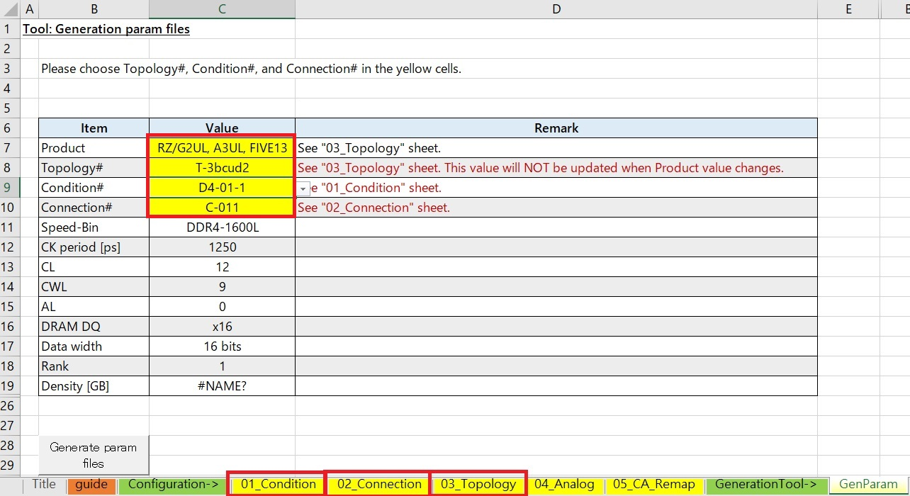
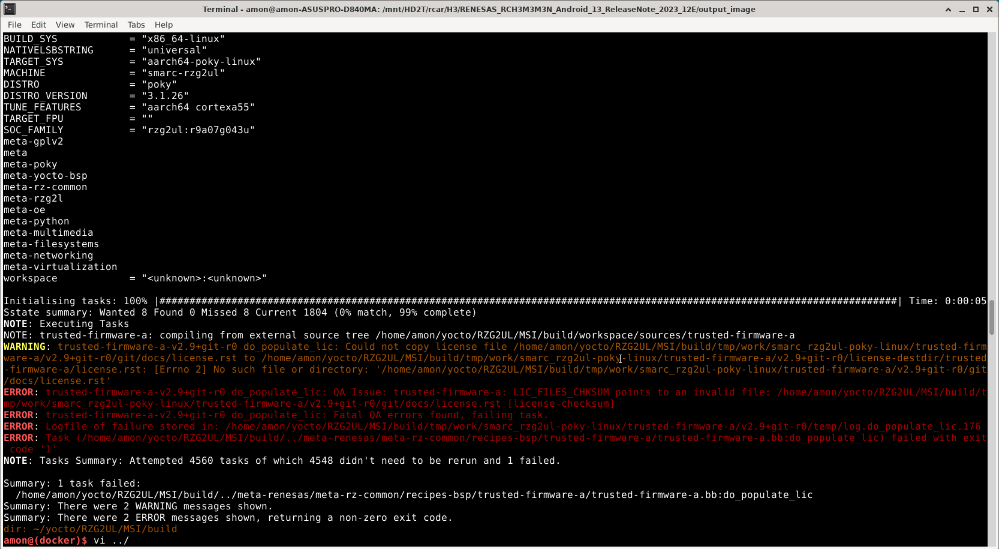
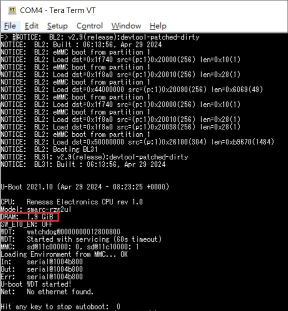
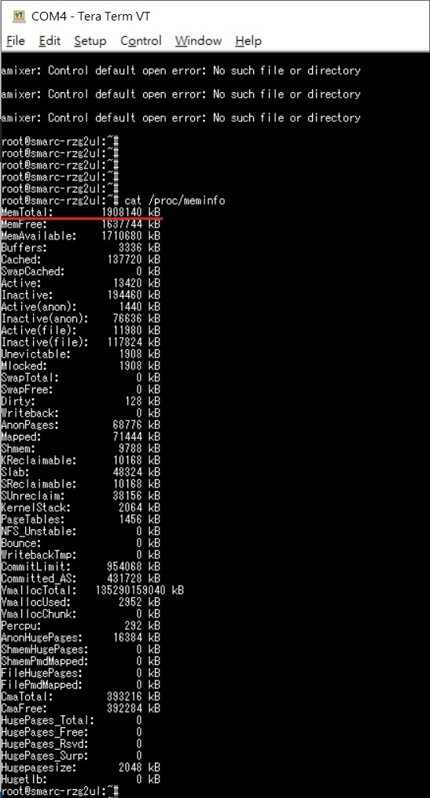

# Renesas RZ/G2UL DDR Config Record
* Target: Config DDR from 1G(Byte) to 2G(Byte)

* MSI change DDR to Micron MT40A1G16TB-062E (is **pin to pin** with RZG2UL EVK, like below)

||DDR Product type|DDR Spec|
|---|---|---|
|RZG2UL-EVK|Micron-MT40A512M16LY-062E|DDR4 – 1Gbyte|
|MSI-RZG2UL-eng-ver1|Micron - MT40A1G16TB-062E|DDR4 – 2Gbyte|

* Base on **RZ/G Verified Linux Package v3.0.5-update3**

## Modify Decription:
#### 1. flash-writer
git path: https://github.com/renesas-rz/rzg2_flash_writer/commits/rz_g2l/  
Branch: rz_g2l  
Checkout: [ff167b676547f3997906c82c9be504eb5cff8ef0](https://github.com/renesas-rz/rzg2_flash_writer/tree/ff167b676547f3997906c82c9be504eb5cff8ef0)

* makefile

```
diff --git a/makefile b/makefile
index 0d4c834..89ed5fb 100644
--- a/makefile
+++ b/makefile
@@ -89,7 +89,7 @@ else ifeq ("$(BOARD)", "RZG2UL_SMARC")
 FILENAME_ADD = _RZG2UL_SMARC
 DEVICE   = RZG2UL
 DDR_TYPE = DDR4
-DDR_SIZE = 1GB_1PCS
+DDR_SIZE = 2GB_1PCS
 SWIZZLE  = T3BCUD2
 DEVICE_TYPE = 1
 else ifeq ("$(BOARD)", "RZG2UL_TYPE2_SMARC")
```

#### 2. trusted-firmware-a
git path: https://github.com/renesas-rz/rzg_trusted-firmware-a/tree/v2.9/rz  
Branch: v2.9/rz  
Checkout: [cc18695622e5637ec70ee3ae8eb5e83b09d13804](https://github.com/renesas-rz/rzg_trusted-firmware-a/tree/cc18695622e5637ec70ee3ae8eb5e83b09d13804)

**Follow below step**  
**2-1. Download [RZ/G2UL Easy Download Guide](https://www.renesas.com/us/en/document/gde/rzg2ul-easy-download-guide?r=1467991)**


**2-2. Open the DDR config generation tool**  
DDR4/DDR3L, DDR Config Generation Tool -> RZG2L_G2UL_Five_A3UL_DDR_config_generation_tool_v3.0.1.xlsm

**Note: This file only support Office 365 or Office 2021專業增強版**

**2-3. Generation C file and put in folder**

>According guide 4~6. Checking **"05_CA_Remap"** sheet with DDR pin, and modify them if needed. Then setting "Topology", "Condition", "Connection" in **"GenParam"** sheet, and push the "Generate param files" button.  
The "param_mc.c" and "param_swizzle.c" will generated.



 **Note: In this case, "MT40A1G16TB-062E" is pin to pin with "MT40A512M16LY-062E", so "05_CA_Remap" no need modify.**
 
 You can rename C file as below, then put them in the follow folder
 
 > **Rename:** param_mc.c → param_mc_{Connection#}_{Condition#}.c
 > (ex: param_mc_C_D4-01-1.c)
 > **Folder:** plat/renesas/rz/soc/{PLAT}/drivers/ddr
 > **Rename:** param_swizzle.c → param_swizzle_{Topology#}.c
 > (ex：param_swizzle_T3bcud.c, param_swizzle_other.c)
 > **Folder:** plat/renesas/rz/common/drivers/ddr

**Note: Below Patch it my rename example (param_xxx_Amon.c), you can follow the guide.**

**2-4. Edit the makefile "rz_board.mk"  (plat/renesas/rz/board/${board}/rz_board.mk)**

* plat/renesas/rz/board/g2ul_smarc/rz_board.mk

```
diff --git a/plat/renesas/rz/board/g2ul_smarc/rz_board.mk b/plat/renesas/rz/board/g2ul_smarc/rz_board.mk
index 4ab752aa2..59fb762ff 100644
--- a/plat/renesas/rz/board/g2ul_smarc/rz_board.mk
+++ b/plat/renesas/rz/board/g2ul_smarc/rz_board.mk
@@ -5,8 +5,8 @@
 #
 
 
-DDR_SOURCES    +=      plat/renesas/rz/soc/${PLAT}/drivers/ddr/param_mc_C-011_D4-01-2.c        \
-                               plat/renesas/rz/common/drivers/ddr/param_swizzle_T3bcud2.c
+DDR_SOURCES    +=      plat/renesas/rz/soc/${PLAT}/drivers/ddr/param_mc_C-011_2GB_Amon.c       \
+                               plat/renesas/rz/common/drivers/ddr/param_swizzle_T3bcud2_Amon.c
 
 DDR_PLL4       := 1600
 $(eval $(call add_define,DDR_PLL4))
```

#### 3. u-boot
git path: https://github.com/renesas-rz/renesas-u-boot-cip/tree/v2021.10/rz  
Branch: rv2021.10/rz  
Checkout: [fe9d08bec2006356760b70bb2f72ba2ba5aed5fd](https://github.com/renesas-rz/renesas-u-boot-cip/tree/fe9d08bec2006356760b70bb2f72ba2ba5aed5fd)

* arch/arm/dts/smarc-rzg2ul.dts

```
diff --git a/arch/arm/dts/smarc-rzg2ul.dts b/arch/arm/dts/smarc-rzg2ul.dts
index 487323a710..f3ae1d11fd 100644
--- a/arch/arm/dts/smarc-rzg2ul.dts
+++ b/arch/arm/dts/smarc-rzg2ul.dts
@@ -28,7 +28,7 @@
        memory@48000000 {
                device_type = "memory";
                /* first 128MB is reserved for secure area. */
-               reg = <0 0x48000000 0 0x38000000>;
+               reg = <0 0x48000000 0 0x78000000>;
        };
 
 };
```

* include/configs/smarc-rzg2ul.h

```
diff --git a/include/configs/smarc-rzg2ul.h b/include/configs/smarc-rzg2ul.h
index 7a56bc6bf8..593d04470d 100644
--- a/include/configs/smarc-rzg2ul.h
+++ b/include/configs/smarc-rzg2ul.h
@@ -43,11 +43,11 @@
 
 #define DRAM_RSV_SIZE                  0x08000000
 #define CONFIG_SYS_SDRAM_BASE          (0x40000000 + DRAM_RSV_SIZE)
-#define CONFIG_SYS_SDRAM_SIZE          (0x40000000u - DRAM_RSV_SIZE) //total 1GB
+#define CONFIG_SYS_SDRAM_SIZE          (0x80000000u - DRAM_RSV_SIZE) //total 2GB
 #define CONFIG_SYS_LOAD_ADDR           0x58000000
 #define CONFIG_LOADADDR                        CONFIG_SYS_LOAD_ADDR // Default load address for tfpt,bootp...
 #define CONFIG_VERY_BIG_RAM
-#define CONFIG_MAX_MEM_MAPPED          (0x40000000u - DRAM_RSV_SIZE)
+#define CONFIG_MAX_MEM_MAPPED          (0x80000000u - DRAM_RSV_SIZE)
 
 #define CONFIG_SYS_MONITOR_BASE                0x00000000
 #define CONFIG_SYS_MONITOR_LEN         (1 * 1024 * 1024)
```

## How to use

```
$MACHINE=smarc-rzg2ul devtool modify flash-writer
// Follow "Patch file" or "#Modify Decription" to modify

$MACHINE=smarc-rzg2ul devtool modify trusted-firmware-a
// Follow "Patch file" or "#Modify Decription" to modify
// If license no such file, check #Other error solved

$MACHINE=smarc-rzg2ul devtool modify u-boot
// Follow "Patch file" or "#Modify Decription" to modify


// Build
$MACHINE=smarc-rzg2ul bitbake core-image-bsp
```
## Other error solved
Error: **LIC_FILES_CHKSUM** file No such file or directory


Modify ${project}/meta-renesas/meta-rz-common/recipes-bsp/trusted-firmware-a/trusted-firmware-a.bb

```
DESCRIPTION = "Trusted Firmware-A for Renesas RZ"

LICENSE = "BSD-3-Clause & MIT & Apache-2.0"
LIC_FILES_CHKSUM = " \
-        file://${WORKDIR}/git/docs/license.rst;md5=b2c740efedc159745b9b31f88ff03dde \
+        file://docs/license.rst;md5=b2c740efedc159745b9b31f88ff03dde \
"
......
......

```

## Final Output
**U-Boot**  


**System**  
